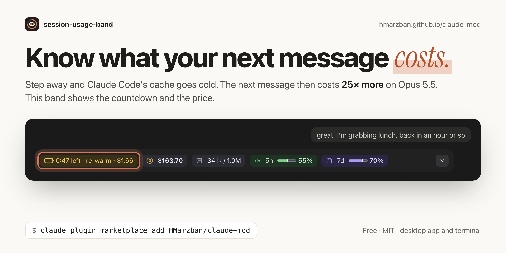

# hossein-mods

Mods for [Claude Code](https://claude.com/claude-code): small plugins that
draw inside Claude Code itself, written with its function-hooks API.



| Plugin | What it does |
| --- | --- |
| [session-usage-band](plugins/session-usage-band/README.md) | A calm band above the prompt: prompt-cache countdown, cost, tokens, context and your 5-hour and weekly limits, with an expanded view of four cards. See its [changelog](plugins/session-usage-band/CHANGELOG.md) for the current version. |

## session-usage-band at a glance

What each chip tells you:


On the desktop app's Code tab, expanded:


In the terminal:

```
◷ cache 52m   $3.19   Σ 225k   ◔ ██░░░░ 76k / 200k   5h ░░░░░░ 4% │ ↻ 3h 00m   7d ██░░░░ 30% │ ↻ 2d 19h   ▿
```

On the desktop app's Code tab the glyphs are icons and the bars are drawn
meters. Press `▿` for the expanded view: a line saying where you are (the
project, its git branch or worktree, uncommitted changes and ahead/behind),
then four cards (Cache, Spend, Context and Limits) with every fact
labelled. See the [plugin's README](plugins/session-usage-band/README.md)
for how to read it.

## Requirements

- Claude Code with mods (function-hooks plugins). Tested on Claude Code
  2.1.295 in the terminal, and on the desktop app with its bundled 2.1.289.
- The terminal or the desktop app's Code tab. Those are the surfaces that
  draw a band above the prompt.

## Install

```bash
claude plugin marketplace add HMarzban/claude-mod
claude plugin install session-usage-band@hossein-mods
```

To work on it, add your clone instead: `claude plugin marketplace add
./claude-mod`, from the folder that holds it.

Then run `/reload-plugins` in a running session, or start a new one.

## Update

```bash
claude plugin marketplace update hossein-mods
claude plugin update session-usage-band@hossein-mods
```

Then `/reload-plugins`.

## Uninstall

```bash
claude plugin uninstall session-usage-band@hossein-mods
claude plugin marketplace remove hossein-mods
```

## Repository layout

```
.claude-plugin/marketplace.json   the marketplace index
plugins/session-usage-band/       the plugin: manifest, hooks, types, tests
  CHANGELOG.md                    what changed in each version
.github/                          issue and pull request templates, CI
```

## Found a bug? Have an idea?

Reports from real sessions are what make the band better, so please tell
us what you see.

- **Something looks wrong**, such as a price that seems off, a chip that
  wraps or a band that doesn't draw: [open a bug report](https://github.com/HMarzban/claude-mod/issues/new?template=bug_report.yml). A
  screenshot of the band helps most.
- **Something you wish it showed:** [suggest a feature](https://github.com/HMarzban/claude-mod/issues/new?template=feature_request.yml).
- **You'd like to fix it yourself:** pull requests are welcome.
  [CONTRIBUTING.md](CONTRIBUTING.md) has the development loop and the rules
  the code follows.

Everyone taking part agrees to the [Code of Conduct](CODE_OF_CONDUCT.md).
To report a security issue, see [SECURITY.md](SECURITY.md).

## License

[MIT](LICENSE)
