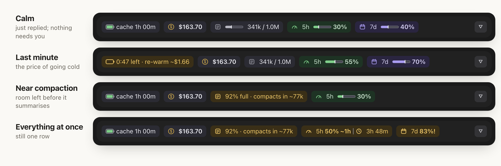
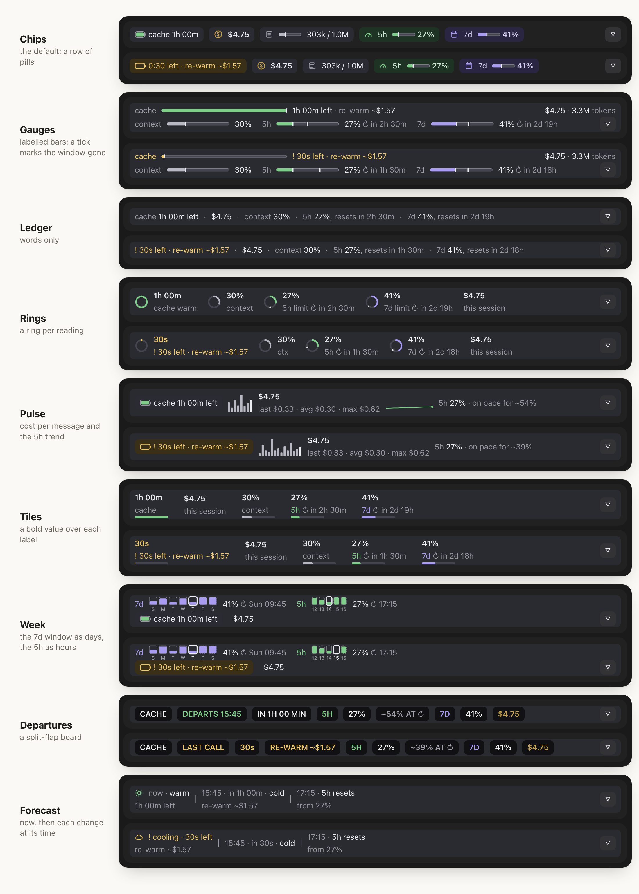
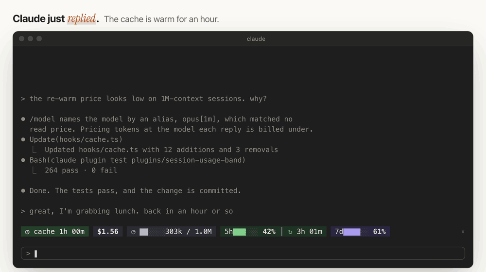

<div align="center">

# claude-mod

**Know what your next Claude Code message costs.**

A live band above the Claude Code prompt: the prompt-cache countdown, what a
re-warm will cost, the session's spend, context fill, and your 5-hour and
weekly limits.

[](https://github.com/HMarzban/claude-mod/actions/workflows/ci.yml)
[](https://github.com/HMarzban/claude-mod/releases/latest)
[](LICENSE)

[Website](https://hmarzban.github.io/claude-mod/) · [Install](#install) · [What it shows](#what-it-shows) · [How it works](#how-it-works) · [FAQ](#faq) · [Contributing](#contributing)

</div>

<picture>
  <source media="(prefers-color-scheme: dark)" srcset="docs/band-film-dark.gif">
  
</picture>

## Why

Step away from Claude Code longer than its prompt cache lasts (5 minutes or
an hour after the last request) and your next message writes the whole
conversation to the cache again, at more than the full input price. On a
long conversation that's a dollar or more, and nothing in Claude Code tells
you it's coming. While the cache is warm, each message re-reads the
conversation on Anthropic's side at a fraction of the input price.

**session-usage-band** shows the countdown and the price, and keeps your
spend and limits in view while you work.

## Install

**Needs** Claude Code with mods (function-hooks plugins), outside WSL, which
doesn't load plugins. Tested on 2.1.295 in the terminal and the desktop app's
bundled 2.1.289. The one-line install below needs 2.1.292 or later
(`claude --version`); on an older one, use the two steps underneath.

One command, in any terminal:

```bash
claude plugin install session-usage-band --marketplace HMarzban/claude-mod
```

Then start a new session, or run `/reload-plugins` in an open one. The band
appears above the prompt. A new conversation reads `cache warming` until
Claude's first reply, `cache warm` while Claude is replying, then counts
down from `cache 1h 00m` (or `cache 5:00` on a five-minute cache). A session
that was already open may read `cache –` until Claude's next reply. Hid it
(`Hide band`, key `h`)? `/usage-band` brings it back. Nothing above the
prompt? Check the Needs line above (mods, and WSL), or
[open a bug report](https://github.com/HMarzban/claude-mod/issues/new?template=bug_report.yml).

The band draws in the terminal and in the desktop app's Code tab, and a
plugin installed from either is available in the other.

<details>
<summary>Inside a session, on an older Claude Code, or for a whole team</summary>

**Inside a terminal session** (Claude Code 2.1.275 or later). It asks you to
confirm adding the marketplace, then opens the plugin's details, where you
pick a scope:

```
/plugin install session-usage-band --marketplace HMarzban/claude-mod
```

**Before Claude Code 2.1.292**, the one-line form isn't there. Use two steps:

```bash
claude plugin marketplace add HMarzban/claude-mod
claude plugin install session-usage-band@hossein-mods
```

**For a team**, commit this to the repository's `.claude/settings.json`.
Once a teammate trusts the folder, Claude Code fetches the marketplace in the
background and turns the band on. It needs no install command, since the band
loads straight from the marketplace. If it isn't showing yet, run
`/reload-plugins`:

```json
{
  "extraKnownMarketplaces": {
    "hossein-mods": { "source": { "source": "github", "repo": "HMarzban/claude-mod" } }
  },
  "enabledPlugins": { "session-usage-band@hossein-mods": true }
}
```

</details>

<details>
<summary>Update or uninstall</summary>

```bash
# update, then /reload-plugins
claude plugin marketplace update hossein-mods
claude plugin update session-usage-band@hossein-mods

# uninstall
claude plugin uninstall session-usage-band@hossein-mods
claude plugin marketplace remove hossein-mods
```

</details>

## What it shows


- **Cache**: time until it goes cold, and the re-warm price in its last minute
- **Cost**: the session's total
- **Context**: how close auto-compaction is
- **5h**: your 5-hour limit, and whether your pace runs out first
- **7d**: your weekly limit and its reset

<picture>
  <source media="(prefers-color-scheme: dark)" srcset="docs/band-states-dark.png">
  
</picture>

These and three more play live, with a guided tour, on the
[website](https://hmarzban.github.io/claude-mod/#live).

Prefer another shape? `/usage-band layout <name>` draws the same readings
in one of nine [layouts](plugins/session-usage-band/README.md#layouts):
`chips` (as above), `gauges` (bars), `ledger` (words alone), `rings`,
`pulse` (trends), `tiles`, `week` (day cells), `departures` (a split-flap
board) or `forecast`.

<picture>
  <source media="(prefers-color-scheme: dark)" srcset="docs/band-layouts-dark.png">
  
</picture>

In every layout a reading turns amber when it needs you: the cache's last
minute, context near auto-compaction, a limit at 80% or a 5-hour pace that
would run out before the reset. Nothing is ever red. On the desktop, hover
any chip in chips for a one-line explanation.

Resume or fork a session (`claude --resume`, `/resume`, or a past session
in the desktop app) and the band picks up its cache and spend where they
were ([how it reads them](plugins/session-usage-band/README.md#reopening-an-old-session)).

Press `▿` to open every fact, under a line that says where you are: the
project, its git branch or worktree, uncommitted changes and ahead/behind.
Chips opens four labelled cards; each other layout opens its own view.


In the terminal it's text, and pieces give way, least important first, as the
window narrows:

<picture>
  <source media="(prefers-color-scheme: dark)" srcset="docs/band-demo-terminal-dark.gif">
  
</picture>

The [plugin's README](plugins/session-usage-band/README.md) covers every chip,
card, command and setting.

## How it works

It's a **mod**: a Claude Code plugin written with the function-hooks API.
A `ui.render` hook draws the band above the prompt, and the other hooks watch
turns, steps and compactions. It's TypeScript and JSX, with no dependencies
and no build step.

- **The price comes from your own bill.** No pricing table is reachable from
  a mod, so the band solves the base rate from the session's cost and token
  counts. Each kind of token is a fixed multiple of input:

  ```
  cost = rate × (uncached + 1.25 × written + read share × read + 5 × output)
  ```

  where read share is the cache-read multiple: 0.1, lower on some models.

  A re-warm is then the whole context written to the cache again.
- **It remembers across sessions:** the layout you chose, when each session
  last had a reply, the rate it solved for each model, and a week of 5-hour
  and weekly readings for the week layout. A reopened session reads what it
  spent from its transcript.
- **It stays out of the way.** It never calls a model, never writes files
  and never sends anything anywhere. Besides two read-only git commands for
  the workspace line, it runs only `grep` and `tail`, to read an old
  session's transcript. [SECURITY.md](SECURITY.md) lists exactly what it
  reads.

## FAQ

**Does it cost tokens?** No. It never calls a model, and it never suggests
sending a message to keep the cache warm. That would mean burning tokens to
avoid burning tokens.

**Is the re-warm price exact?** It's an estimate, always shown with `~`. It
uses Claude Code's own ledger, which prices every cache write at 1.25×.
Anthropic bills a 1-hour cache write at 2×, so per-token API users on a
1-hour cache may pay up to 1.6× the estimate.

**How does it know if my cache lasts 5 minutes or an hour?** It can't read
your billing, so it assumes an hour and corrects itself to 5 minutes if it
sees the cache rebuild sooner. On a resumed session, the transcript's last
cache write says which until the band's first reply. Set
`CLAUDE_CODE_PROMPT_CACHE_TTL=5m` or `1h` to remove the guess.

**Does the 5-hour pace include my other sessions?** Yes. The limit is shared
across all your Claude use, so the pace counts every session and device.

**Does it work on light themes?** Yes. Set `CC_BAND_APPEARANCE=light`, or
`plain` for theme colours only. `NO_COLOR` is respected. Set it in the
shell you start Claude Code from (`export CC_BAND_APPEARANCE=light`, then
`claude`); the band reads it when a session starts.

**The row runs past the edge of my terminal.** Some terminals draw the
band's glyphs (`█ │ · Σ`) two columns wide. In a Japanese, Chinese or
Korean locale the band draws ASCII by itself; otherwise set
`CC_BAND_GLYPHS=ascii`, which also suits a screen reader.

## Contributing

This is a young project, and the best way to improve it is to hear what you
see in your own sessions.

- **Something looks wrong**, such as a price that seems off, a chip that
  wraps or a band that doesn't draw:
  [open a bug report](https://github.com/HMarzban/claude-mod/issues/new?template=bug_report.yml).
  A screenshot of the band helps most.
- **Something you wish it showed:**
  [suggest a feature](https://github.com/HMarzban/claude-mod/issues/new?template=feature_request.yml).
- **You'd like to build it:** pull requests are welcome.

### Good places to start

- **The tokens chip hides too early on the desktop.** Chips' row fits by
  `squeezeToFit` against `columns - ROW_SLACK` (`hooks/views/chips.tsx`).
  `DESKTOP` (`hooks/layout.ts`) estimates text width roughly, so the row
  keeps `ROW_SLACK` spare and the tokens chip, first to give way, drops
  before it has to. Calibrating that estimate from screenshots would let it
  show.
- **Screenshots** of the light palette, a narrow terminal or a cold cache
  for the docs.
- **A new mod.** This repo is a marketplace: add your own plugin under
  `plugins/` and list it in `.claude-plugin/marketplace.json`, then run
  `claude plugin validate .`, then `claude plugin validate` and
  `claude plugin test` on your plugin's folder.

### Development loop

```bash
git clone https://github.com/HMarzban/claude-mod.git
cd claude-mod
```

[CONTRIBUTING.md](CONTRIBUTING.md) has the gates, the loop for seeing a
change live, the module map and the rules the code follows.

<details>
<summary>Repository layout</summary>

```
.claude-plugin/marketplace.json     the marketplace index (named hossein-mods)
plugins/session-usage-band/
  hooks/                            the band: the hooks, the readings and the nine layouts
  tests/                            the test suite
  CHANGELOG.md                      what changed in each version
docs/                               the website (GitHub Pages) and the images in this README
tools/                              the demo builder, the golden capture, the views gate, a single-test runner
.github/                            issue and pull request templates, CI
```

Every module, test helper and tool is in
[CONTRIBUTING.md's module map](CONTRIBUTING.md#how-the-code-is-laid-out).

</details>

Everyone taking part agrees to the [Code of Conduct](CODE_OF_CONDUCT.md). To
report a security issue, see [SECURITY.md](SECURITY.md).

## License

[MIT](LICENSE) © Hossein Marzban
