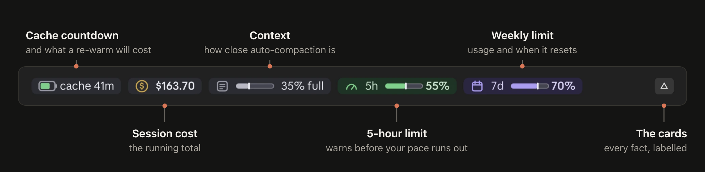
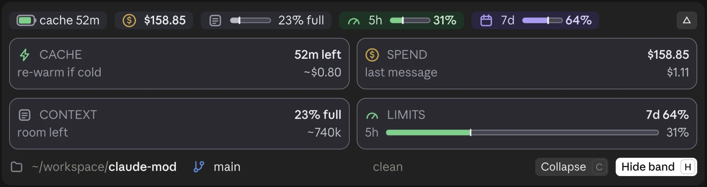
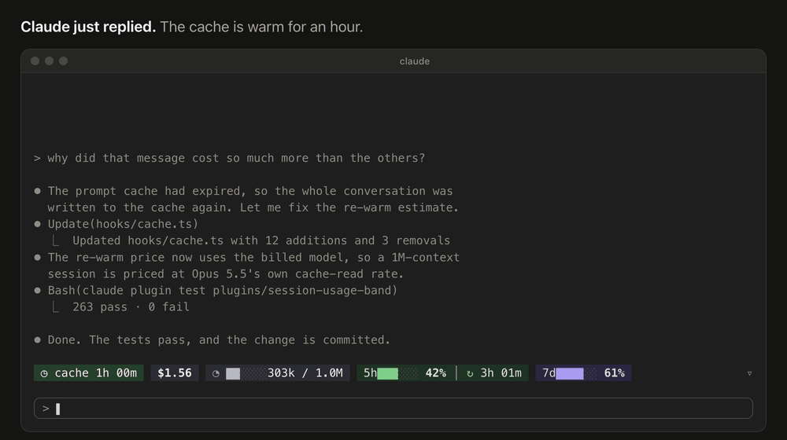

<div align="center">

# claude-mod

**Know what your next Claude Code message costs.**

A live band above the Claude Code prompt: the prompt-cache countdown, what a
re-warm will cost, the session's spend, context fill, and your 5-hour and
weekly limits.

[](https://github.com/HMarzban/claude-mod/actions/workflows/ci.yml)
[](https://github.com/HMarzban/claude-mod/releases/latest)
[](LICENSE)

[Install](#install) · [What it shows](#what-it-shows) · [How it works](#how-it-works) · [FAQ](#faq) · [Contributing](#contributing)

</div>


## Why

Claude Code caches your conversation on Anthropic's side, so each message
re-reads it at a fraction of the input price. The cache lasts 5 minutes or
an hour after the last request. Step away longer, and your next message
writes the whole conversation to the cache again, at more than the full
input price. On a long conversation that's a dollar or more, and nothing in
Claude Code tells you it's coming.

**session-usage-band** shows the countdown and the price, and keeps your
spend and limits in view while you work.

## Install

```bash
claude plugin marketplace add HMarzban/claude-mod
claude plugin install session-usage-band@hossein-mods
```

Then run `/reload-plugins`, or start a new session. It draws in the terminal
and in the desktop app's Code tab.

**Needs** Claude Code with mods (function-hooks plugins). Tested on 2.1.295
in the terminal and the desktop app's bundled 2.1.289.

<details>
<summary>Update or uninstall</summary>

```bash
# update, then /reload-plugins
claude plugin marketplace update hossein-mods
claude plugin update session-usage-band@hossein-mods

# uninstall
claude plugin uninstall session-usage-band@hossein-mods
claude plugin marketplace remove hossein-mods
```

</details>

## What it shows



A chip turns amber when it needs you: the cache's last minute, context near
auto-compaction, a limit at 80% or a 5-hour pace that would run out before
the reset. Nothing is ever red. Hover any chip for a one-line explanation.

Press `▿` for four cards with every fact labelled, under a line that says
where you are: the project, its git branch or worktree, uncommitted changes
and ahead/behind.



In the terminal it's text, and it narrows gracefully as the window does:



The [plugin's README](plugins/session-usage-band/README.md) covers every chip,
card, command and setting.

## How it works

It's a **mod**: a Claude Code plugin written with the function-hooks API.
A `ui.render` hook draws the band above the prompt, and the other hooks watch
turns, steps and compactions. It's TypeScript and JSX, with no dependencies
and no build step.

- **The price comes from your own bill.** No pricing table is reachable from
  a mod, so the band solves the base rate from the session's cost and token
  counts. Each kind of token is a fixed multiple of input:

  ```
  cost = rate × (uncached + 1.25 × written + read share × read + 5 × output)
  ```

  A re-warm is then the whole context written to the cache again.
- **It remembers across sessions.** Reopen an old session, and it recalls
  when the last reply was and the rate it solved, or reads them once from
  the end of the transcript.
- **It stays out of the way.** It never calls a model, never writes files
  and never sends anything anywhere. Besides two read-only git commands for
  the workspace line, it runs only `tail`, to read the end of an old
  session's transcript. [SECURITY.md](SECURITY.md) lists exactly what it
  reads.

## FAQ

**Does it cost tokens?** No. It never calls a model, and it never suggests
sending a message to keep the cache warm. That would mean burning tokens to
avoid burning tokens.

**Is the re-warm price exact?** It's an estimate, always shown with `~`. It
uses Claude Code's own ledger, which prices every cache write at 1.25×.
Anthropic bills a 1-hour cache write at 2×, so per-token API users on a
1-hour cache may pay up to 1.6× the estimate.

**How does it know if my cache lasts 5 minutes or an hour?** It can't read
your billing, so it assumes an hour and corrects itself to 5 minutes if it
sees the cache rebuild sooner. Set `CLAUDE_CODE_PROMPT_CACHE_TTL=5m` or
`1h` to remove the guess.

**Does the 5-hour pace include my other sessions?** Yes. The limit is shared
across all your Claude use, so the pace counts every session and device.

**Does it work on light themes?** Yes. Set `CC_BAND_APPEARANCE=light`, or
`plain` for theme colours only. `NO_COLOR` is respected.

## Contributing

This is a young project, and the best way to improve it is to hear what you
see in your own sessions.

- **Something looks wrong**, such as a price that seems off, a chip that
  wraps or a band that doesn't draw:
  [open a bug report](https://github.com/HMarzban/claude-mod/issues/new?template=bug_report.yml).
  A screenshot of the band helps most.
- **Something you wish it showed:**
  [suggest a feature](https://github.com/HMarzban/claude-mod/issues/new?template=feature_request.yml).
- **You'd like to build it:** pull requests are welcome.

### Good places to start

- **The tokens chip hides too early on the desktop.** The band's width
  estimate for the 5h and 7d chips runs about 15px short, so it keeps a wide
  safety margin. Calibrating it from screenshots would let the chip show.
- **Screenshots** of the light palette, a narrow terminal or a cold cache
  for the docs.
- **A new mod.** This repo is a marketplace: add your own plugin under
  `plugins/` and list it in `.claude-plugin/marketplace.json`.

### Development loop

```bash
git clone https://github.com/HMarzban/claude-mod.git
cd claude-mod
claude plugin validate plugins/session-usage-band   # what the module hooks and calls
claude plugin test plugins/session-usage-band       # the test suite
```

To see a change live, add your clone as the marketplace
(`claude plugin marketplace add ./claude-mod` from its parent folder),
install, then `claude plugin update session-usage-band@hossein-mods` and
`/reload-plugins` after each edit. [CONTRIBUTING.md](CONTRIBUTING.md) has the
type check, the module map and the rules the code follows.

<details>
<summary>Repository layout</summary>

```
.claude-plugin/marketplace.json     the marketplace index (named hossein-mods)
plugins/session-usage-band/
  hooks/register.tsx                the hooks: the only module that touches the engine
  hooks/band.tsx                    a pure function from a snapshot to the drawn band
  hooks/cache.ts                    the prompt-cache model and the re-warm price
  hooks/*.ts(x)                     layout, readings, formatting, memory, git, palettes
  tests/                            one file per area, helpers in helpers.ts
  CHANGELOG.md                      what changed in each version
docs/                               the images in this README
.github/                            issue and pull request templates, CI
```

</details>

Everyone taking part agrees to the [Code of Conduct](CODE_OF_CONDUCT.md). To
report a security issue, see [SECURITY.md](SECURITY.md).

## License

[MIT](LICENSE) © Hossein Marzban
